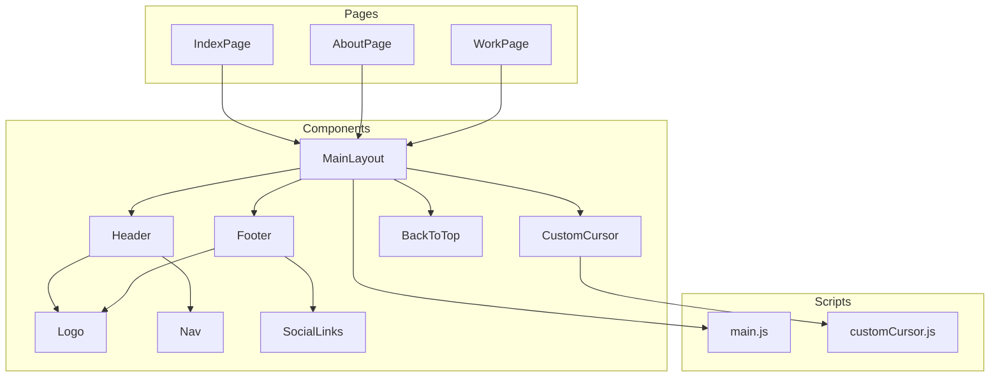

# Astro Project Refactoring & Optimization Plan

---

## 1. Component Reusability & Structure

- **Extract Logo SVG into a dedicated `<Logo />` component**
  - Currently duplicated in both `Header.astro` and `Footer.astro`.
  - Replace inline SVGs with `<Logo />` for maintainability.
  
- **Modularize Inline SVG Icons**
  - The hero section and other parts use complex inline SVGs.
  - Extract these into reusable icon components or use an SVG sprite system.
  
- **Split Large Inline Scripts**
  - The `MainLayout.astro` contains a large inline script handling:
    - Smooth scrolling
    - Scroll event handling
    - IntersectionObserver animations
    - Back-to-top button logic
  - Move these into a dedicated client-side JS module (e.g., `src/scripts/main.js`) and import it.
  - Improves separation of concerns and caching.

- **Refactor `CustomCursor`**
  - Move the embedded class to an external TypeScript or JavaScript module.
  - Consider throttling mousemove events for performance.
  - Confirm TypeScript compatibility or convert to plain JS.
  - Add feature detection and accessibility fallbacks.

---

## 2. Styling Improvements

- **Remove Debug Borders**
  - The global CSS currently has debug borders; remove for production.

- **Centralize Global Styles**
  - Import `global.css` once in the main layout or via `astro.config.mjs`.

- **Optimize CSS Variables**
  - Consider adding dark mode variables and toggling via a class or media query.

- **Leverage CSS `scroll-behavior`**
  - Since `scroll-behavior: smooth;` is set globally, simplify or remove JS smooth scroll logic if native CSS suffices.

---

## 3. Performance Enhancements

- **Lazy Load Heavy Assets**
  - Use `loading="lazy"` for images.
  
- **Optimize SVGs**
  - Minify SVGs or convert to symbols/sprites.
  - Reduce inline SVG complexity where possible.

- **Bundle & Minify Scripts**
  - Ensure all JS is bundled and minified in production.

---

## 4. Accessibility Improvements

- **Navigation**
  - Add ARIA labels or roles to nav elements.
  - Ensure focus states are visible and clear.

- **Back-to-Top Button**
  - Ensure it is keyboard accessible and has appropriate ARIA labels.

- **Custom Cursor**
  - Ensure it does not interfere with focus outlines or screen readers.
  - Optionally disable for accessibility modes.

---

## 5. Content & Data Management

- **Dynamic Content Generation**
  - Generate repeated content like cards dynamically from data arrays.
  
- **Markdown or CMS Integration**
  - For blog or portfolio sections, consider sourcing content from Markdown files or a headless CMS.

---

## 6. Code Quality & Best Practices

- **TypeScript Consistency**
  - Confirm build setup transpiles inline TypeScript.
  - Otherwise, convert to plain JavaScript or move to `.ts` modules.

- **File Organization**
  - Create `src/scripts/` for client-side JS.
  - Create `src/icons/` or `src/components/icons/` for SVG components.

---

## Visual Overview

---

## Summary Checklist

- [ ] Extract and reuse `<Logo />` component
- [ ] Modularize inline SVG icons
- [ ] Move inline scripts to external JS modules
- [ ] Remove debug CSS borders
- [ ] Centralize global CSS import
- [ ] Simplify smooth scroll logic
- [ ] Optimize SVGs and images
- [ ] Improve accessibility (ARIA, focus states)
- [ ] Refactor `CustomCursor` script
- [ ] Generate repeated content dynamically
- [ ] Ensure TypeScript compatibility or convert to JS
- [ ] Organize files into `scripts/`, `icons/`, etc.